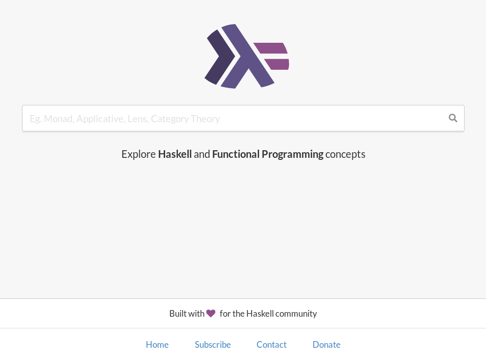
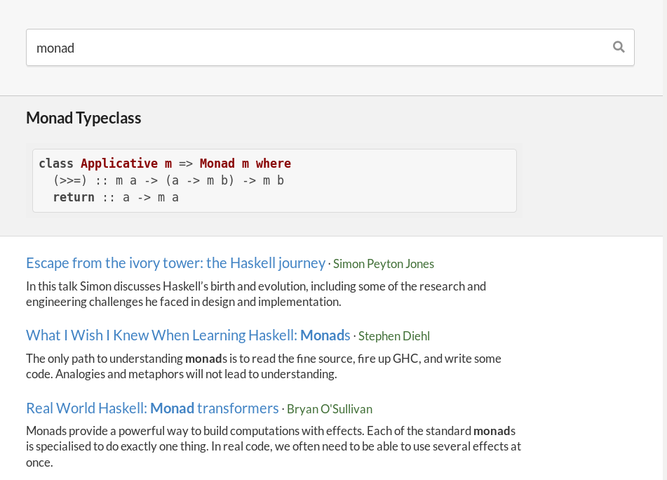

# Haskell Bazaar

_Explore Haskell and Functional Programming concepts_
[https://haskellbazaar.com](https://haskellbazaar.com)


[Backend README](./backend/README.md) | [Frontend README](./frontend/README.md) | [Contributing](./CONTRIBUTING.md)


The Haskell community has produced so many high quality tutorials, articles, talks, courses, papers. But it is difficult for newcomers to navigate them and appreciate how they fit together. `Haskell Bazaar` is an attempt to make it simpler for learners to navigate FP/Haskell resources.





## Development

### Setup docker Secrets

Go to the `./secrets` folder and define the following files based on the provided templates

* `psql-db`: name of the postgres database
* `psql-password`: password of the postgres database
* `psql-user`: user of the postgres database
* `mailchimp-api-key`: Mailchimp API key
* `mailchimp-base-url`: Mailchimp Base url
* `mailchimp-list-id`: Mailchimp List id

One can also run the following bash command to use the provided defaults

```
cd secrets; for f in *default; do cp $f "${f//.default/}"; done;
```

### Docker Compose

Run the following command to setup the dev environment and then point your browser to `localhost:8080`
```
docker-compose up
```
Go grab a coffe because it will take time to build the Haskell backend images

## License

Copyright © 2018 Arthur Caillau

Distributed under the Eclipse Public License either version 1.0 or (at your option) any later version.
